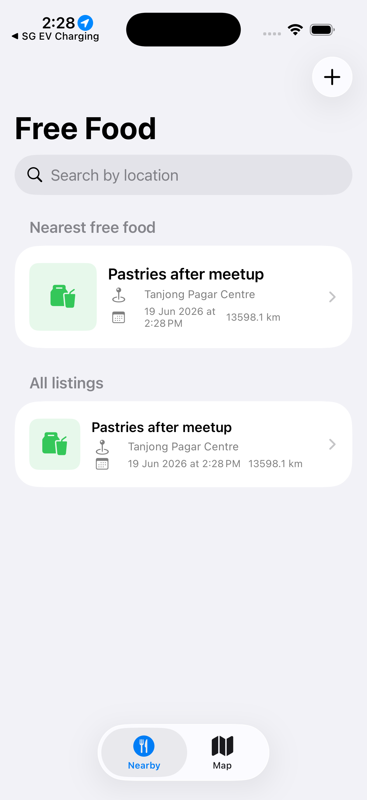

<div align="center">

# FreeFood

[](https://www.swift.org/)
[](https://developer.apple.com/ios/)
[](https://developer.apple.com/xcode/swiftui/)
[](https://developer.apple.com/documentation/mapkit)
[](#license)

**A native iOS app for sharing leftover food nearby and reducing food waste.**

[Report Bug](https://github.com/alfredang/freefoodapp/issues) . [Request Feature](https://github.com/alfredang/freefoodapp/issues)

</div>

## Screenshot



## About

FreeFood is a SwiftUI iOS app for posting and discovering free leftover food from events, offices, meetups, and community spaces. It focuses on fast local sharing: create a listing with photos, location, schedule, and details; browse a searchable feed; and view available food on an Apple Map. Published on the App Store as "FreeFood: Share Leftovers".

### Key Features

| Feature | Description |
| --- | --- |
| Food listings | Add food title, details, date, start time, end time, and up to 3 photos. |
| Apple Maps search | Search MapKit locations when choosing where the food can be collected. |
| Nearby feed | Highlights the nearest available listing when location access is enabled. |
| Search | Filter listings by location, title, or event details. |
| Map view | Browse listings as map markers and open listing details from the map. |
| On-device storage | Stores listings locally as JSON in Application Support. |
| Auto-expiry | Purges listings after 7 days to keep stale food posts out of the feed. |

## Tech Stack

| Layer | Technology |
| --- | --- |
| App UI | SwiftUI, NavigationStack, TabView, Form, List |
| Maps & Location | MapKit, CoreLocation |
| Photos | PhotosUI |
| State Management | ObservableObject, EnvironmentObject, @StateObject |
| Persistence | Codable JSON stored in Application Support |
| Platform | iOS 17+, iPhone and iPad simulator/device |
| Build Tooling | Xcode, xcodebuild |

## Architecture

```text
FreeFood
|
+-- SwiftUI App Entry
|   +-- FreeFoodApp
|       +-- FoodListingStore
|       +-- LocationManager
|
+-- Views
|   +-- ContentView
|   +-- ListingFeedView
|   +-- AddListingView
|   +-- ListingDetailView
|   +-- FoodMapView
|
+-- Services
|   +-- FoodListingStore       Local JSON persistence and expiry cleanup
|   +-- LocationManager        Location permission and current location
|   +-- LocationSearchService  MapKit place search
|
+-- Models
    +-- FoodListing
    +-- Coordinate
```

## Project Structure

```text
freefoodapp/
+-- freefoodapp.xcodeproj/
+-- freefoodapp/
|   +-- Assets.xcassets/
|   +-- Models/
|   |   +-- FoodListing.swift
|   +-- Services/
|   |   +-- FoodListingStore.swift
|   |   +-- LocationManager.swift
|   |   +-- LocationSearchService.swift
|   +-- Views/
|   |   +-- AddListingView.swift
|   |   +-- ContentView.swift
|   |   +-- FoodMapView.swift
|   |   +-- ListingDetailView.swift
|   |   +-- ListingFeedView.swift
|   +-- Info.plist
|   +-- PrivacyInfo.xcprivacy
|   +-- freefoodappApp.swift
+-- ExportOptions.plist
+-- screenshot.png
+-- README.md
```

## Getting Started

### Prerequisites

- macOS with Xcode 16 or newer
- iOS 17+ simulator or device
- Git

### Clone

```sh
git clone https://github.com/alfredang/freefoodapp.git
cd freefoodapp
```

### Run in Xcode

1. Open `freefoodapp.xcodeproj`.
2. Select the `freefoodapp` scheme.
3. Choose an iOS simulator or connected device.
4. Press Run.

### Build from Terminal

```sh
xcodebuild \
  -project freefoodapp.xcodeproj \
  -scheme freefoodapp \
  -configuration Debug \
  -sdk iphonesimulator \
  build
```

## Data & Privacy

- Listings are stored on-device in `Application Support/FreeFood/listings.json`.
- The app requests location access to rank nearby listings and show user-location map controls.
- Food listing photos are selected locally through PhotosUI.
- The current prototype does not send listing data to a backend service.

## Deployment

This is a native iOS app. For App Store or TestFlight distribution, archive the app in Xcode or use:

```sh
xcodebuild \
  -project freefoodapp.xcodeproj \
  -scheme freefoodapp \
  -configuration Release \
  -archivePath build/freefoodapp.xcarchive \
  archive
```

Export options can be configured through `ExportOptions.plist`.

## Roadmap

- Cloud sync for shared community listings.
- Listing moderation and reporting.
- Push notifications for nearby food drops.
- Better distance formatting and location simulation defaults for screenshots/tests.
- UI tests for listing creation, search, and map navigation.

## Contributing

Contributions are welcome through issues and pull requests.

1. Fork the repository.
2. Create a feature branch.
3. Commit focused changes.
4. Open a pull request with a clear description and screenshots for UI changes.

## Developed By

Tertiary Infotech Academy Pte. Ltd.

## License

No license file is currently included. Add a license before distributing or accepting external contributions.
